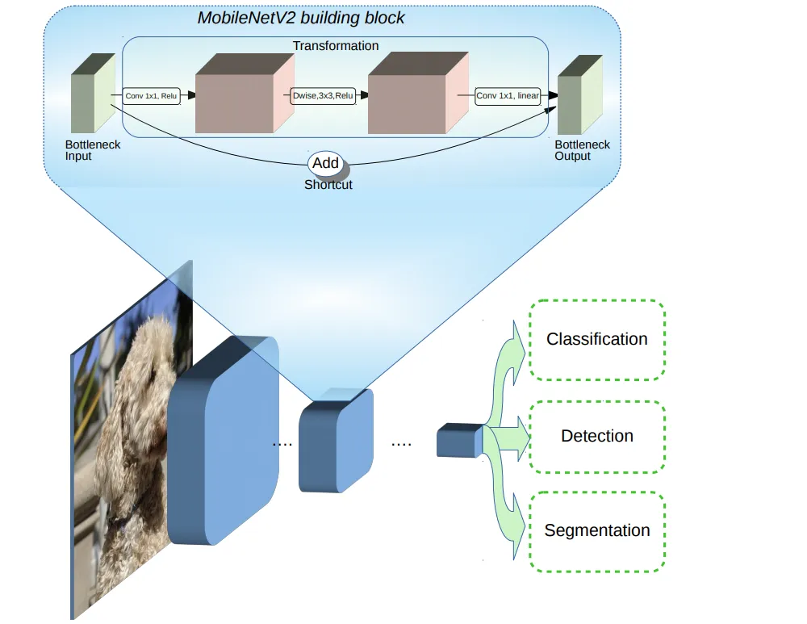

# Face Mask Recognition Using TensorFlow and Keras
## Language and Framework Versions:
- python 3.11
- TensorFlow 2.12

## DataSet:
The data set is cloned from [this repository](https://github.com/prajnasb/observations).
### Note on the Training dataset:
Training samples are artificially synthesized to add masks to them.

## Review Results:
You can run **review_results.py** after cloning this repository. This will open your camera and do a live test on your smiley face. 
<!-- ## Model Architecture:

**MobileNetV2**, developed by Google, is used for the training process. -->

